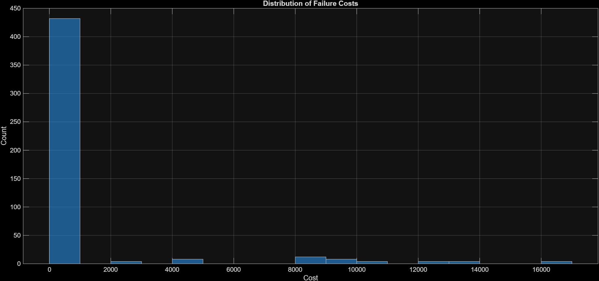
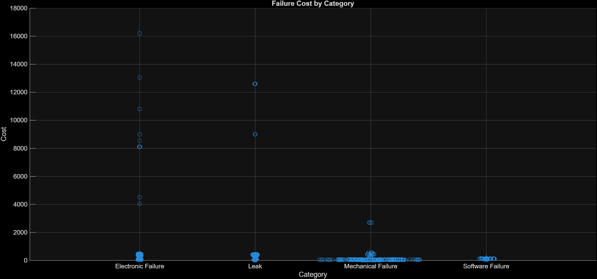

# Equipment Failure Analysis in MATLAB

This project analyzes equipment failure reports from a factory using MATLAB. The analysis combines data processing, visualization, and text-based filtering to identify cost drivers and support decision-making.

## Dataset

The dataset contains 480 equipment failure reports. Each record includes:

- Description — brief explanation of the issue  
- Category — type of failure (electrical, mechanical, leaks, software)  
- Urgency — severity level (low, medium, high)  
- Resolution — method used to resolve the issue  
- Cost — total cost associated with the failure  

## Objective

The objective of this project is to:

- identify high-cost failure patterns  
- evaluate their contribution to total maintenance cost  
- extract actionable insights for cost reduction  

---

## Methodology

The analysis follows a structured workflow:

### Data Import and Exploration
- Loaded the dataset using `importReports`  
- Inspected table structure using `head` and `summary`  

### Data Visualization
- Examined distribution of failure costs  
- Analyzed number of failures by category  
- Analyzed number of failures by urgency  

### Category vs Cost Analysis
- Compared cost distributions across failure categories  
- Identified categories with the highest concentration of expensive failures  

### Filtering High-Cost Failures
- Selected entries with:
  - Category = Electronic Failure  
  - Cost > 1000  
- Sorted results in descending order  

### Text Analysis
- Normalized text using `lower`  
- Identified recurring terms in descriptions  
- Focused on the term "power"  

### Targeted Data Extraction
- Used `contains` to filter power-related failures  
- Created a subset (`powerReports`)  

### Cost Contribution Analysis
- Calculated:
  - share of total cost attributed to power-related failures  
  - share of total reports represented by these failures  

---

## Results

The analysis indicates that power-related electronic failures contribute significantly to total maintenance cost, despite not being the most frequent type of failure.

---

## Conclusion

Power-related failures represent a high-impact category and should be prioritized for further investigation.  

Potential actions include:

- implementation of power stabilization systems  
- improved monitoring of electrical infrastructure  
- preventive maintenance strategies  

---

## Visualizations

### Distribution of Failure Costs

### Failure Cost by Category

### Number of Failures by Category

### Number of Failures by Urgency

---

## How to Run

1. Open `equipment_failure_analysis.mlx` in MATLAB  
2. Ensure that `importReports.mlx` is in the same directory  
3. Run the script  

---

## Tools

- MATLAB  
- Live Script (.mlx)  
- Table-based data analysis  
- String processing functions  

---

## Author

Master’s student with experience in MATLAB-based data analysis and engineering workflows.
